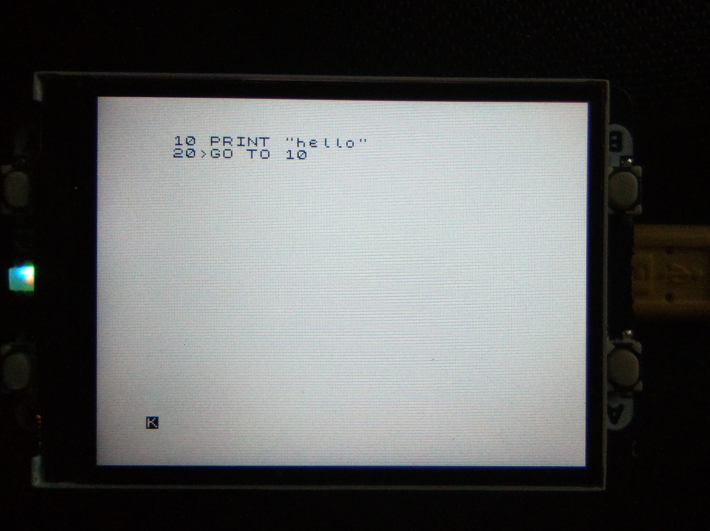
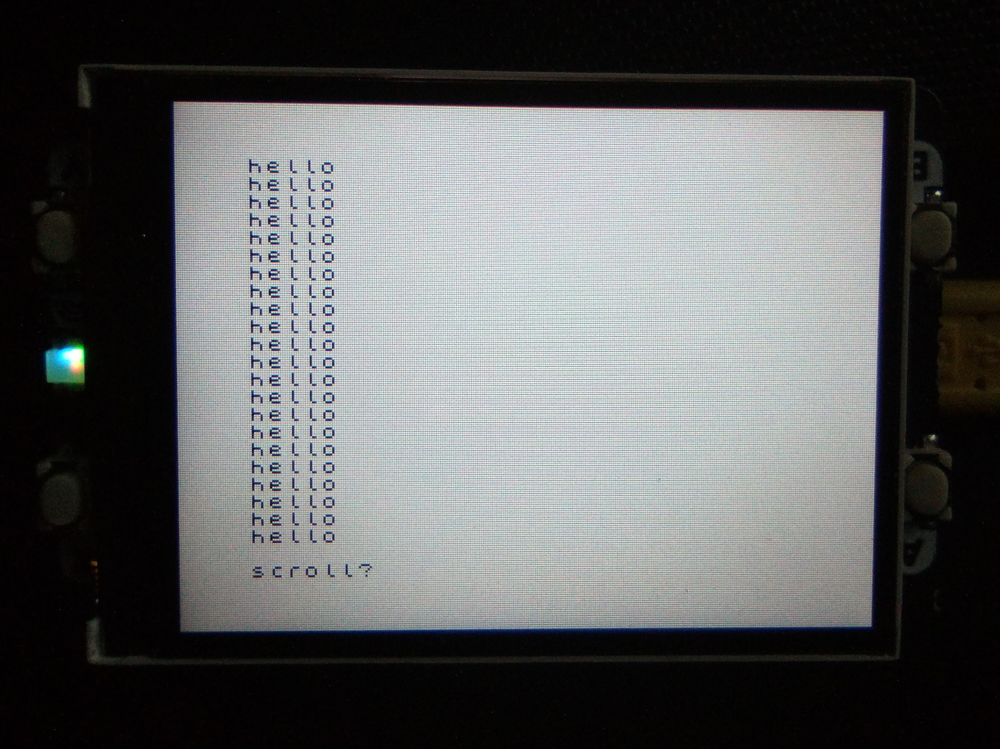

# pico-zxspectrum

It's been 40 years... I still remember the computery smell when I unboxed mine at Xmas (I *think* 1983)

So for old times' sake here's a ZX Spectrum emulator for Raspberry Pi pico.
, using:
- screen: a 5cm 320x240 TFT display as screen.
- keyboard: USB serial connection for now
- sound: not sure yet
- cassette recorder: the plan is to transmit tapes over USB serial...


## Status

[X] display: fully operational
[x] keyboard: serial works using python client (apart from extended mode)
[ ] sound
[ ] cassette recorder





## Build

Requires pico-sdk (and probably tinyUSB...). In the repo root:

```sh
mkdir -p build && cd build
export PICO_SDK_PATH=../../pico-sdk-1.3.0
cmake ..
make -j
```

## Install

Something like (from the repo root):
```
cp build/picozxspectrum.uf2 /media/$USER/RPI-RP2/
```

## Use

Python code depends on pyserial and pynput. Very much a work in progress...

```
python zxkb.py
```


## Acknowledgements

Most of the C and C++ source code is copied or modified from: https://github.com/Jean-MarcHarvengt/MCUME
