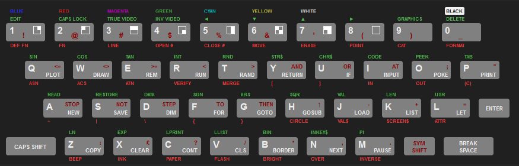

# pico-zxspectrum

It's been 40 years... I still remember the computery smell when I unboxed mine at Xmas (I *think* 1983)

So for old times' sake here's a ZX Spectrum emulator for Raspberry Pi pico, using:

- screen: a 5cm 320x240 TFT display as screen.
- keyboard: USB serial connection, which also supports image loading
- sound: not sure yet...
- cassette recorder: the plan is to transmit tapes over USB serial, possibly at the original speed...

## Status

- [X] display: fully operational
- [X] keyboard: serial works using a basic python client
- [ ] sound
- [ ] real-time(?) tape loading
- [X] image loading over USB serial: Z80 and SNA formats supported
- [ ] image saving over USB serial


## Build

Requires [pico-sdk](https://github.com/raspberrypi/pico-sdk) (and its dependencies e.g. tinyUSB...). In the repo root:

```sh
mkdir -p build && cd build
export PICO_SDK_PATH=../../pico-sdk-1.3.0 # adjust as necessary
cmake ..
make -j
```

## Install

Something like (from the repo root):

```sh
cp build/picozxspectrum.uf2 /media/$USER/RPI-RP2/
```

## Use

Interaction requires a (rudimentary) keyboard driver written in python and depends on pyserial and pynput. It will also load an image (Z80 or SNA) on startup:

```sh
python zx.py [image]
```

Keys map closely to the ZX Spectrum keyboard (below), with shift=caps shift, left ctrl=symbol shift. Shift-left-ctrl enters extended mode.
Unmapped keys such as backspace and the arrow keys emulate shift-0,5,6,7,8

Esc followed by ctrl-C exits the listener.



## Acknowledgements

Much of the C and C++ source code originates from: https://github.com/Jean-MarcHarvengt/MCUME. Copyright notices, where present, have been preserved.

This was also very useful: http://www.breakintoprogram.co.uk/computers/zx-spectrum.

Keyboard layout from https://dotneteer.github.io/spectnetide/getting-started/use-keyboard-tool
