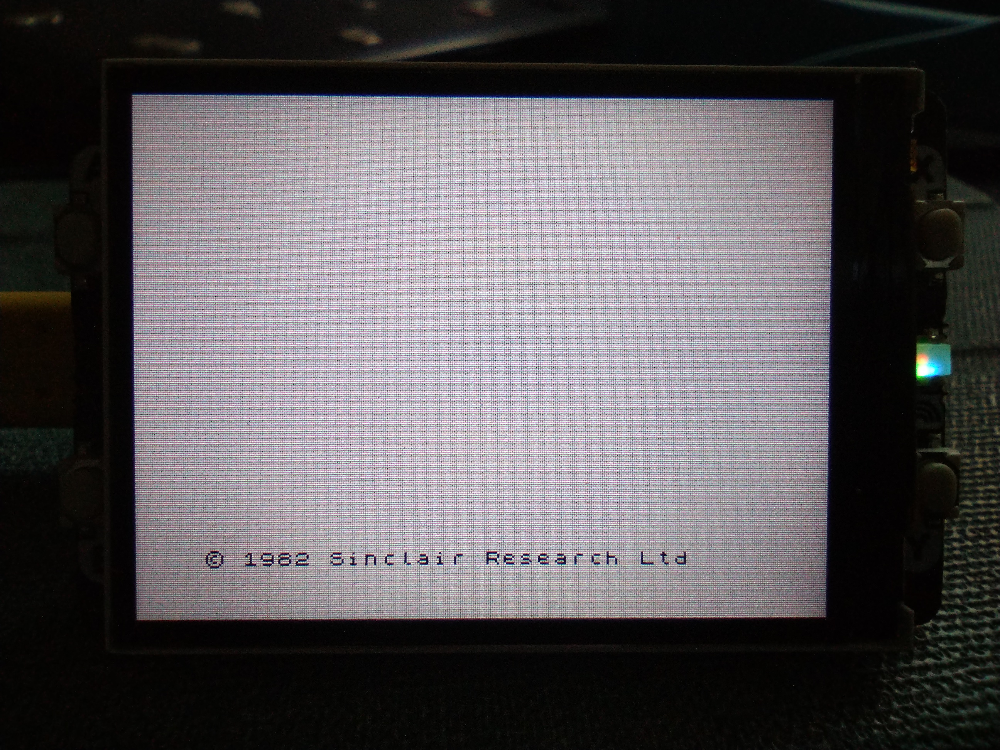
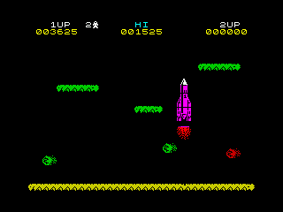
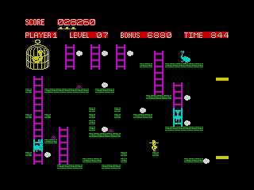

# pico-zxspectrum

It's been 40 years... I still remember the computery smell when I unboxed mine at Xmas (I *think* 1983)

So for old times' sake here's a ZX Spectrum emulator for the [Raspberry Pi pico](https://www.raspberrypi.com/documentation/microcontrollers/raspberry-pi-pico.html), using:

- screen: a [5cm 320x240 TFT display](https://shop.pimoroni.com/products/pico-display-pack-2-0?variant=39374122582099) as screen.
- keyboard: USB serial connection
- sound: not sure yet...
- cassette recorder: life's too short...

## Status

- [X] display: fully operational
- [X] keyboard: serial works using a basic python client
- [ ] sound
- [ ] real-time(?) tape loading
- [X] image loading over USB serial: Z80 and SNA formats supported
- [X] image saving over USB serial: Z80 format
- [X] save screenshot over USB serial: png format



 
 


## Dependencies

Requires [pico-sdk](https://github.com/raspberrypi/pico-sdk) (and its dependencies e.g. tinyUSB...), plus the [pimoroni-pico](https://github.com/pimoroni/pimoroni-pico) libraries. In the repo root:

Ensure tinyUSB sources are present in the `lib` subdir of the SDK (extract or symlink to a release here, or use git submodules), e.g.

```sh
cd pico-sdk-1.4.0/lib
rmdir tinyusb # will be empty initially
ln -s ../../tinyusb-0.13.0 tinyusb
```

## Configuration

```sh
ln -s ../pico-sdk-1.4.0 pico-sdk # adjust version and location as necessary
ln -s pico-sdk/external/pico_sdk_import.cmake
ln -s ../pimoroni-pico # adjust to wherever you cloned it to
```

## Build

```sh
mkdir -p build && cd build
export PICO_SDK_PATH=../../pico-sdk # adjust as necessary
cmake ..
make -j
```

## Install

Something like (from the repo root):

```sh
cp build/picozxspectrum.uf2 /media/$USER/RPI-RP2/
```

## Use

Interaction requires a (rudimentary) keyboard driver written in python and depends on pyserial and pynput. It will also load an image (Z80 or SNA) on startup:

```sh
python zx.py [image]
```

Keys map closely to the ZX Spectrum keyboard (below), with `LShift`as caps shift, `RCtrl` is symbol shift. `LShift+RCtrl` enters extended mode. Various unmapped keys also work, such as `Backspace` and the arrow keys which emulate caps-shifted 0,5,6,7,8 respectively.

`PrtScr` triggers an screenshot save (png format)

`Ins` triggers an image save (registers and RAM in Z80 format)

`Del` or the screen's `X` button resets the device to the last image loaded/saved, or ZX basic.

`Esc` followed by `Ctrl+C` exits the keyboard listener.


## Acknowledgements

Much of the C and C++ source code originates from: https://github.com/Jean-MarcHarvengt/MCUME. Copyright notices, where present, have been preserved.

These were also very useful:
http://www.breakintoprogram.co.uk/computers/zx-spectrum.
https://github.com/fruit-bat/pico-zxspectrum


Keyboard layout from https://dotneteer.github.io/spectnetide/getting-started/use-keyboard-tool
