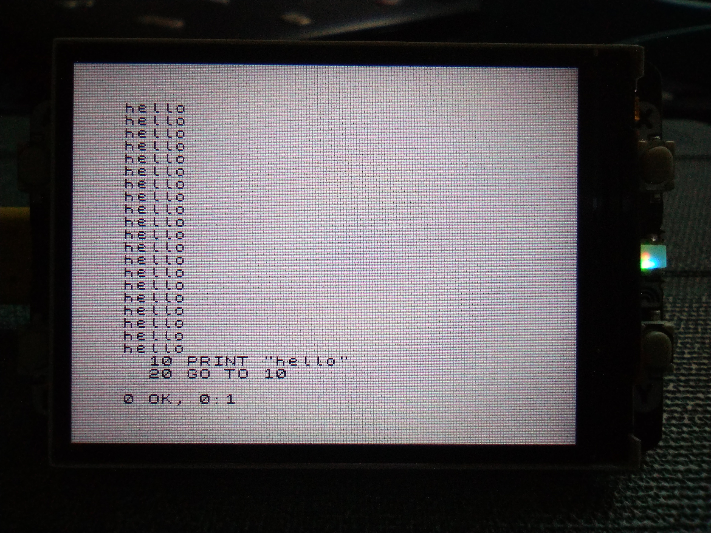

# pico-zxspectrum

It's been 40 years... I still remember the computery smell when I unboxed mine at Xmas (I *think* 1983)

So for old times' sake here's a ZX Spectrum emulator for Raspberry Pi pico.
, using:
- screen: a 5cm 320x240 TFT display as screen.
- keyboard: USB serial connection for now
- sound: not sure yet
- cassette recorder: the plan is to transmit tapes over USB serial...


## Status

[X] display: fully operational
[X] keyboard: serial works using a basic python client
[ ] sound
[ ] cassette recorder





## Build

Requires pico-sdk (and probably its dependencies e.g. tinyUSB...). In the repo root:

```sh
mkdir -p build && cd build
export PICO_SDK_PATH=../../pico-sdk-1.3.0 # adjust as necessary
cmake ..
make -j
```

## Install

Something like (from the repo root):

```sh
cp build/picozxspectrum.uf2 /media/$USER/RPI-RP2/
```

## Use

Rudimentary keyboard driver written in python and depends on pyserial and pynput. Very much a work in progress...

```sh
python zxkb.py
```

This is useful:


Shift is caps shift, left ctrl is symbol shift. Shift-left-ctrl (and tab) enters extended mode. Esc followed by ctrl-C exits.

## Acknowledgements

Most of the C and C++ source code is copied or modified from: https://github.com/Jean-MarcHarvengt/MCUME

Keyboard layout from https://dotneteer.github.io/spectnetide/getting-started/use-keyboard-tool